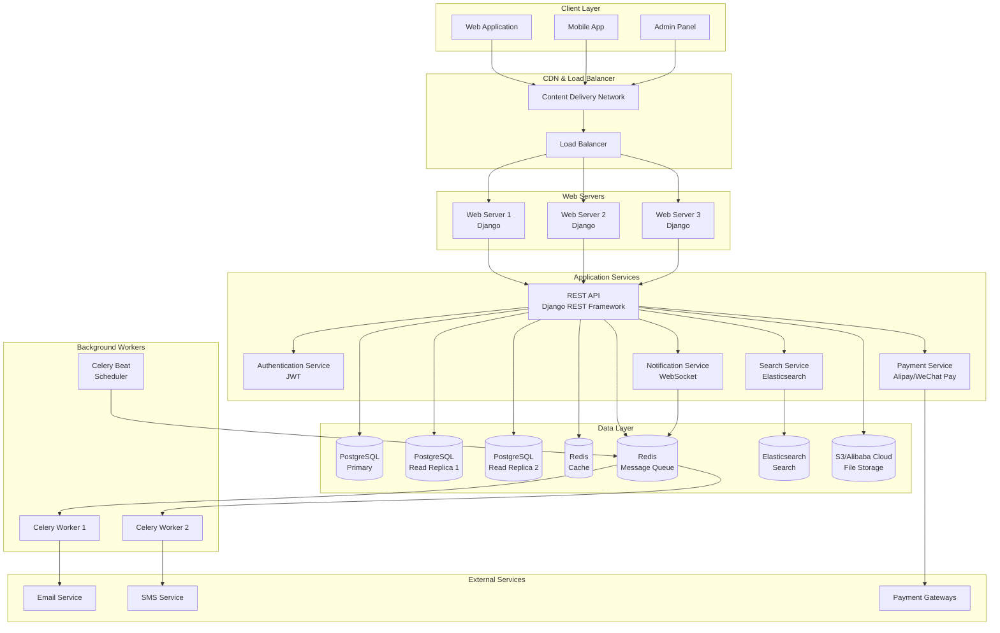
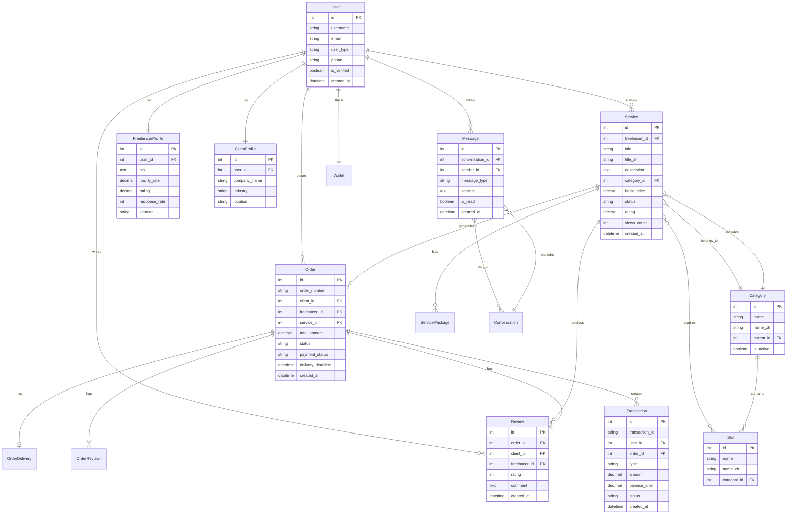
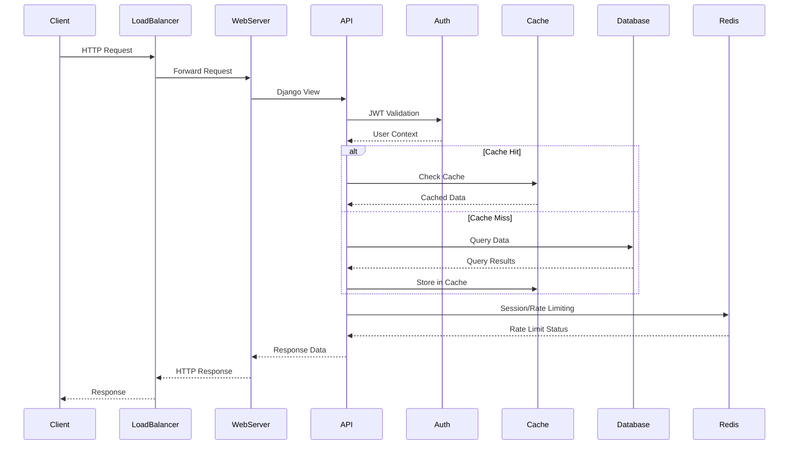
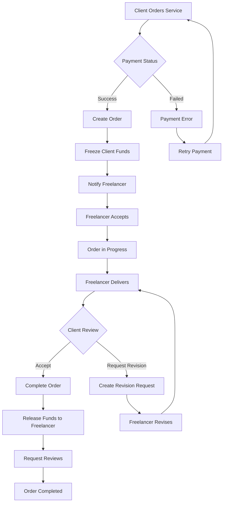
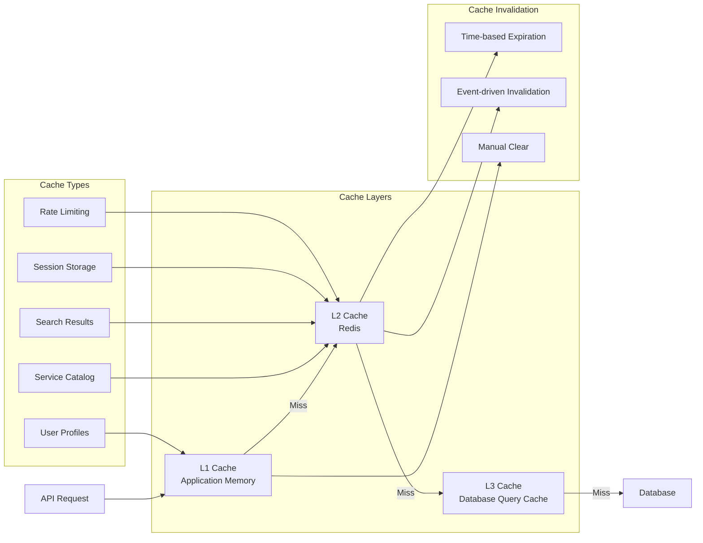
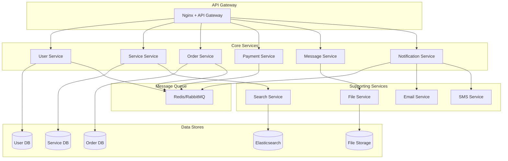
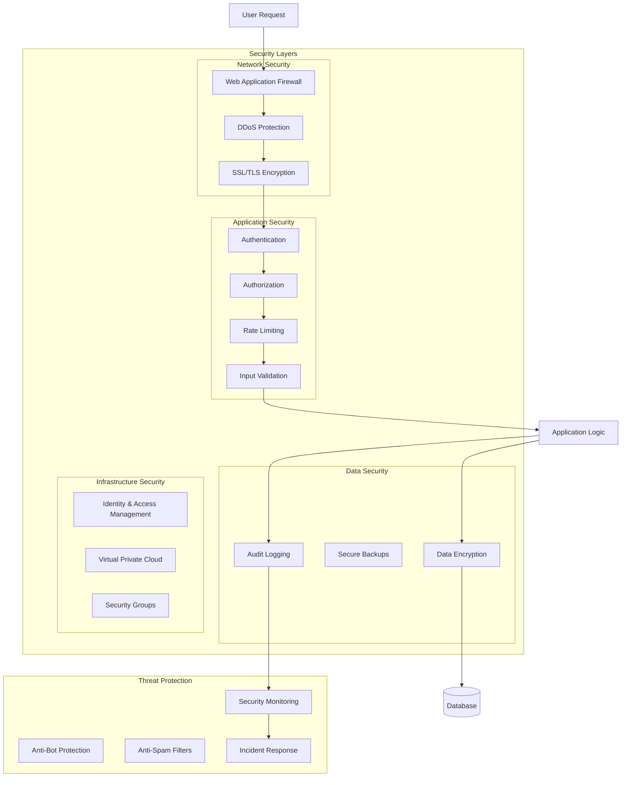

# System Architecture Diagrams - Chinese Freelance Marketplace

## 1. High-Level System Architecture



## 2. Database Schema Relationships



## 3. API Request Flow



## 4. Order Processing Flow



## 5. Caching Strategy



## 6. Microservices Communication



## 7. Deployment Architecture

```mermaid
graph TB
    subgraph "Production Environment"
        subgraph "Web Tier"
            LB1[Load Balancer 1]
            LB2[Load Balancer 2]

            WS1[Web Server 1]
            WS2[Web Server 2]
            WS3[Web Server 3]
            WS4[Web Server 4]
        end

        subgraph "Application Tier"
            API1[API Server 1]
            API2[API Server 2]
            API3[API Server 3]

            Worker1[Celery Worker 1]
            Worker2[Celery Worker 2]
            Worker3[Celery Worker 3]

            Beat[Celery Beat]
        end

        subgraph "Data Tier"
            DB_Master[(PostgreSQL Master)]
            DB_Slave1[(PostgreSQL Slave 1)]
            DB_Slave2[(PostgreSQL Slave 2)]

            Redis_Master[(Redis Master)]
            Redis_Slave[(Redis Slave)]

            ES1[(Elasticsearch 1)]
            ES2[(Elasticsearch 2)]
            ES3[(Elasticsearch 3)]
        end

        subgraph "Storage"
            S3[S3 Bucket]
            CDN[CDN]
        end
    end

    subgraph "Monitoring"
        Monitoring[Monitoring Stack]
        Logging[Logging Stack]
        Alerting[Alerting System]
    end

    LB1 --> WS1
    LB1 --> WS2
    LB2 --> WS3
    LB2 --> WS4

    WS1 --> API1
    WS2 --> API2
    WS3 --> API3

    API1 --> DB_Master
    API2 --> DB_Slave1
    API3 --> DB_Slave2

    API1 --> Redis_Master
    API2 --> Redis_Slave

    API1 --> ES1
    API2 --> ES2
    API3 --> ES3

    WS1 --> S3
    CDN --> S3

    Worker1 --> DB_Master
    Worker2 --> DB_Master
    Worker3 --> DB_Master

    Beat --> Worker1
    Beat --> Worker2
    Beat --> Worker3
```

## 8. Security Architecture



These diagrams provide a comprehensive visual representation of the system architecture, showing how different components interact and how data flows through the system. The architecture is designed to be scalable, secure, and maintainable while supporting the specific requirements of a Chinese freelance marketplace platform.